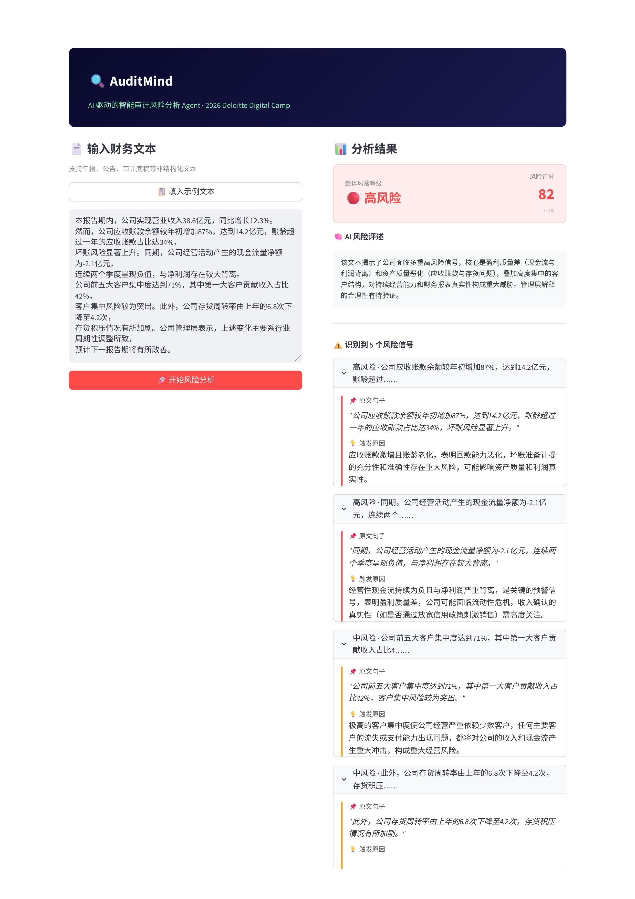
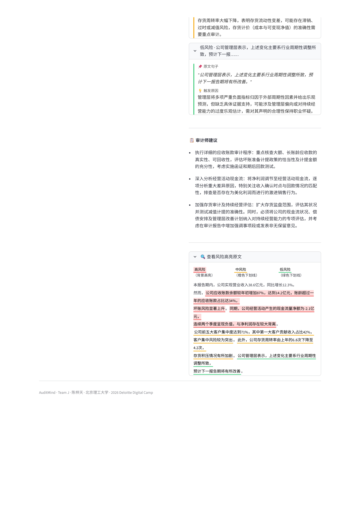

# AuditMind

LLM-based risk-signal extraction from Chinese financial text, with a Streamlit
interface that highlights every flagged sentence back in its original context.

Built for the 2026 Deloitte Digital Camp.




## Problem

Financial-statement footnotes, announcements, and audit working papers contain
risk-relevant language that is easy to miss during manual review — deteriorating
receivables, customer concentration, negative operating cash flow, and so on.
A model that just returns "risk: high" is not usable in an audit context: every
judgment has to be traceable back to the sentence that produced it.

AuditMind takes a block of financial text (annual report excerpts, announcements,
audit memos) and returns sentence-level risk signals, each anchored to its exact
location in the source text, plus an aggregate risk score and a short list of
audit recommendations.

## How it works

- The DeepSeek-V3 API (`deepseek-chat`) is called with a system prompt that
  constrains the model to return a fixed JSON schema: a list of risk sentences
  (each with a severity level and a stated reason), an overall risk level and
  score (0–100), a short summary, and a list of recommendations.
- Returned sentences are matched back against the original input text and
  wrapped in `<mark>` tags with severity-specific styling (background highlight
  for high risk, coloured underline for medium/low), so every AI judgment can be
  traced to its exact source location rather than taken as an opaque label.
- If an exact string match fails (the model paraphrased slightly), the app falls
  back to matching on the first 20 characters of the sentence — a heuristic, not
  a guarantee; see Limitations.
- The interface (Streamlit, two-column layout) lets a user paste text, run the
  analysis, and inspect the risk summary, the per-sentence breakdown, and the
  highlighted original text side by side.

## Example

The app ships with a built-in sample paragraph (synthetic financial-statement
text covering revenue growth alongside a sharp rise in receivables, negative
operating cash flow, high customer concentration, and declining inventory
turnover) so a reviewer can test the pipeline in one click without needing to
supply their own input.

## Tech stack

Python · Streamlit · DeepSeek-V3 API (OpenAI-compatible client)

## Limitations

- No formal evaluation yet: precision/recall against hand-labelled text has not
  been measured. This is the next step (see Roadmap).
- Sentence matching for highlighting uses exact-match with a truncated-prefix
  fallback; it can mis-locate a sentence if the model rephrases it, or double-count
  overlapping matches.
- Severity thresholds (high/medium/low) and the 0–100 aggregate score are defined
  entirely by the prompt, not calibrated against auditor judgment.
- Tested only on Mandarin-language financial text; behaviour on English-language
  filings is unverified.
- Single-model pipeline (DeepSeek-V3 only) — no comparison against a baseline or
  a second model.

## Roadmap

- [ ] Hand-label a sample of financial-text paragraphs and report precision/recall
      for the risk classification and severity assignment
- [ ] Log and categorise failure modes (e.g. hedged forward-looking language,
      negated risk statements)
- [ ] Replace prefix-matching fallback with a more robust sentence-alignment method

## Setup

```bash
git clone https://github.com/chenzitian-BIT-UoR/auditmind.git
cd auditmind
pip install -r requirements.txt
cp .env.example .env   # then edit .env and add your own DEEPSEEK_API_KEY
streamlit run app.py
```

Requires a DeepSeek API key (https://platform.deepseek.com). The app will refuse
to start without one.

## Repository structure

```
auditmind/
├── app.py             # Streamlit app: UI, DeepSeek API calls, highlighting logic
├── requirements.txt
├── .env.example
└── docs/
    └── screenshot1.png
    └── screenshot2.png

```

## Author

Chen Zitian (陈梓天) — Team J, 2026 Deloitte Digital Camp
Undergraduate, Accounting (Sino-Foreign Cooperative Programme), Beijing Institute
of Technology / Henley Business School, University of Reading

## License

MIT

